# Security Hardening Guide

This document outlines the comprehensive security measures implemented in the GCP Landing Zone to protect against threats and ensure compliance with security best practices.

## 🔒 Security Architecture Overview

The security implementation follows defense-in-depth principles with multiple layers of protection:

```mermaid
graph TB
    Internet[🌐 Internet] --> CloudArmor[🛡️ Cloud Armor WAF]
    CloudArmor --> LoadBalancer[⚖️ Load Balancer]
    LoadBalancer --> VPC[🏠 Private VPC]
    
    subgraph "Security Layers"
        VPC --> Firewall[🔥 Firewall Rules]
        Firewall --> PrivateCluster[☸️ Private GKE Cluster]
        PrivateCluster --> BinaryAuth[🔐 Binary Authorization]
        BinaryAuth --> WorkloadID[🆔 Workload Identity]
        WorkloadID --> NetworkPolicy[🕸️ Network Policies]
        NetworkPolicy --> RBAC[👥 RBAC]
        RBAC --> Encryption[🔐 Encryption at Rest/Transit]
    end
    
    subgraph "Monitoring & Compliance"
        SCC[🛡️ Security Command Center]
        Logging[📊 Security Logging]
        KMS[🔑 Cloud KMS]
        IAM[👤 IAM Policies]
    end
```



## 🛡️ Security Controls by Category

### 1. Network Security

#### **Cloud Armor Web Application Firewall**
- **Rate Limiting**: 100 requests per minute per IP
- **Geo-blocking**: Configurable by region
- **OWASP Protection**: 
  - SQL Injection prevention
  - XSS attack blocking
  - CSRF protection
- **Custom Rules**: Environment-specific IP allowlists

```hcl
# Example Cloud Armor configuration
resource "google_compute_security_policy" "security_policy" {
  rule {
    action   = "rate_based_ban"
    priority = "1000"
    rate_limit_options {
      ban_duration_sec = 600
      rate_limit_threshold {
        count        = 100
        interval_sec = 60
      }
    }
  }
}
```

#### **VPC Security Features**
- **Private Subnets**: No public IP addresses for compute resources
- **VPC Flow Logs**: Complete network traffic monitoring
- **Private Google Access**: Secure access to GCP services
- **Custom Routes**: Controlled egress through NAT Gateway

#### **Firewall Rules Hierarchy**
1. **Explicit Deny Rules** (Priority: 65534)
   - Block high-risk ports (telnet, RDP, database ports)
   - Deny all traffic by default
2. **Security-Specific Allow Rules** (Priority: 1000-2000)
   - Health checks from Google Cloud ranges
   - Internal cluster communication
3. **Application Rules** (Priority: 2000+)
   - HTTPS/HTTP traffic
   - Application-specific ports

### 2. Container & Kubernetes Security

#### **GKE Cluster Hardening**
- **Private Clusters**: No public endpoints
- **Workload Identity**: Secure pod-to-GCP service authentication
- **Network Policies**: Pod-to-pod traffic control with Calico
- **Binary Authorization**: Only signed container images allowed
- **Shielded GKE Nodes**: Hardware-level security validation

#### **Node Security Configuration**
```hcl
node_config {
  # Security hardening
  image_type   = "COS_CONTAINERD"  # Container-Optimized OS
  preemptible  = false             # No preemptible nodes for stability
  
  # Disable legacy features
  metadata = {
    disable-legacy-endpoints   = "true"
    ssh-keys                  = ""
    enable-oslogin           = "true"
    block-project-ssh-keys   = "true"
  }
  
  # Shielded instance features
  shielded_instance_config {
    enable_secure_boot          = true
    enable_integrity_monitoring = true
  }
}
```

#### **Pod Security Standards**
- **Restricted Security Context**: Non-root containers only
- **Resource Limits**: CPU and memory constraints
- **Network Policies**: Ingress/egress traffic control
- **Service Mesh**: Istio for mTLS and traffic encryption

### 3. Identity & Access Management (IAM)

#### **Service Account Best Practices**
- **Minimal Permissions**: Least privilege principle
- **Dedicated Accounts**: Separate service accounts per function
- **No JSON Keys**: Workload Identity instead of key files
- **Regular Rotation**: Automated key rotation where required

#### **RBAC Configuration**
```yaml
# Example Kubernetes RBAC
apiVersion: rbac.authorization.k8s.io/v1
kind: ClusterRole
metadata:
  name: security-restricted
rules:
- apiGroups: [""]
  resources: ["pods"]
  verbs: ["get", "list"]
# No "create", "update", "delete" permissions
```

### 4. Data Protection & Encryption

#### **Encryption at Rest**
- **GKE ETCD**: Customer-managed encryption keys (CMEK)
- **Persistent Disks**: Encrypted with Cloud KMS
- **Storage Buckets**: CMEK encryption
- **Database**: TDE (Transparent Data Encryption)

#### **Encryption in Transit**
- **TLS 1.3**: Minimum version for all connections
- **mTLS**: Service-to-service communication
- **VPN/Private Interconnect**: For hybrid connectivity

#### **Key Management**
```hcl
resource "google_kms_crypto_key" "gke_encryption_key" {
  name            = "gke-encryption-key"
  key_ring        = google_kms_key_ring.security_keyring.id
  rotation_period = "7776000s"  # 90 days
  
  lifecycle {
    prevent_destroy = true
  }
}
```

### 5. Monitoring & Compliance

#### **Security Command Center (SCC)**
- **Real-time Monitoring**: Continuous security assessment
- **Threat Detection**: Automatic anomaly detection
- **Compliance Reporting**: SOC 2, ISO 27001, PCI DSS alignment
- **Alert Integration**: Pub/Sub notifications for critical findings

#### **Logging & Auditing**
- **Audit Logs**: All API calls and administrative actions
- **Data Access Logs**: Database and storage access tracking
- **VPC Flow Logs**: Network traffic analysis
- **Container Logs**: Application and system logs

#### **Log Retention Policies**
| Environment | Retention Period | Reason |
|-------------|------------------|--------|
| Development | 90 days | Cost optimization |
| Staging | 1 year | Testing compliance |
| Production | 7 years | Regulatory compliance |

## 🎯 Environment-Specific Security Settings

### Development Environment
- **Security Focus**: Learning and development
- **Binary Authorization**: Disabled for flexibility
- **Network Access**: Broader IP ranges allowed
- **Logging**: Shorter retention (90 days)

### Staging Environment  
- **Security Focus**: Production simulation
- **Binary Authorization**: Enabled with warnings
- **Network Access**: Restricted to corporate networks
- **Logging**: 1-year retention

### Production Environment
- **Security Focus**: Maximum security
- **Binary Authorization**: Enforced blocking
- **Network Access**: Minimal IP ranges only
- **Logging**: 7-year retention for compliance
- **Service Mesh**: Istio with mTLS enforcement

## 🔧 Security Configuration Examples

### 1. Secure GKE Cluster
```hcl
resource "google_container_cluster" "primary" {
  # Private cluster configuration
  private_cluster_config {
    enable_private_nodes    = true
    enable_private_endpoint = false
    master_ipv4_cidr_block  = "172.16.0.0/28"
  }
  
  # Security features
  enable_binary_authorization = true
  database_encryption {
    state    = "ENCRYPTED"
    key_name = var.database_encryption_key
  }
  
  # Enhanced logging
  logging_config {
    enable_components = [
      "SYSTEM_COMPONENTS",
      "WORKLOADS", 
      "API_SERVER"
    ]
  }
}
```

### 2. Firewall Security Rules
```hcl
# Block high-risk ports
resource "google_compute_firewall" "deny_high_risk_ports" {
  name     = "deny-high-risk-ports"
  network  = var.network_name
  priority = 500

  deny {
    protocol = "tcp"
    ports    = ["23", "135", "139", "445", "1433", "3389", "5432"]
  }

  source_ranges = ["0.0.0.0/0"]
  description   = "Block high-risk protocol ports"
}
```

### 3. Binary Authorization Policy
```hcl
resource "google_binary_authorization_policy" "policy" {
  default_admission_rule {
    evaluation_mode  = "REQUIRE_ATTESTATION"
    enforcement_mode = "ENFORCED_BLOCK_AND_AUDIT_LOG"
  }
  
  admission_whitelist_patterns {
    name_pattern = "gcr.io/${var.project_id}/*"
  }
}
```

## 🚨 Incident Response

### Security Monitoring Alerts
1. **High Severity**: Immediate Slack/PagerDuty notification
2. **Medium Severity**: Email alerts within 15 minutes  
3. **Low Severity**: Daily digest reports

### Automated Response Actions
- **Suspicious IPs**: Automatic Cloud Armor blocking
- **Failed Login Attempts**: Account lockout after 5 attempts
- **Resource Anomalies**: Auto-scaling restrictions
- **Compliance Violations**: Immediate notifications to security team

## 📋 Compliance & Standards

### Supported Compliance Frameworks
- **SOC 2 Type II**: System and Organization Controls
- **ISO 27001**: Information Security Management
- **PCI DSS**: Payment Card Industry Data Security
- **GDPR**: General Data Protection Regulation
- **HIPAA**: Health Insurance Portability and Accountability

### Security Assessments
- **Quarterly**: Vulnerability scans and penetration testing
- **Monthly**: Security posture reviews
- **Weekly**: Compliance checklist validation
- **Daily**: Automated security scanning

## 🔄 Security Maintenance

### Regular Tasks
1. **Weekly**: Review Security Command Center findings
2. **Monthly**: Update firewall rules and policies  
3. **Quarterly**: Rotate encryption keys
4. **Annually**: Complete security architecture review

### Automated Updates
- **Security Patches**: Automatic node updates
- **Binary Authorization**: Continuous image scanning
- **Certificate Renewal**: Automatic SSL certificate rotation
- **Policy Updates**: GitOps-driven security policy deployment

This security hardening guide ensures your GCP Landing Zone meets enterprise security requirements while maintaining operational efficiency.
