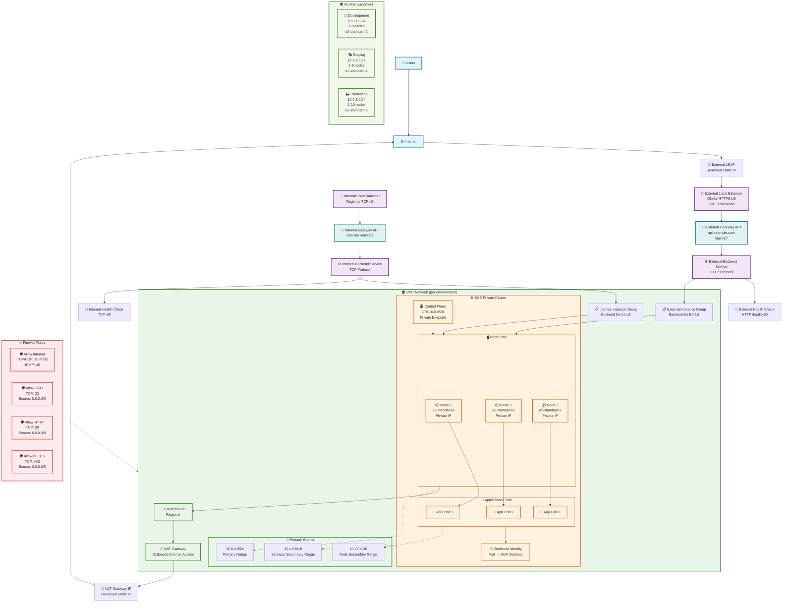

# GCP Landing Zone Network Architecture (OpenTofu + Terragrunt)

## Network Diagram Legend

### 🏗️ **Components Overview**

| Symbol | Component | Description |
|--------|-----------|-------------|
| 🌐 | Internet | External internet connectivity |
| 🔄 | Load Balancer | External/Internal load balancing |
| 🚪 | Gateway API | API gateway for routing |
| 🏠 | VPC Network | Virtual Private Cloud |
| 📡 | Subnet | Network subnet with CIDR ranges |
| 🔀 | Cloud Router | Regional router for NAT |
| ☸️ | GKE Cluster | Kubernetes cluster |
| 🖥️ | Node Pool | Kubernetes worker nodes |
| 📦 | Node | Individual compute node |
| 🎯 | Pods | Kubernetes application pods |
| 🔐 | Workload Identity | Secure pod-to-GCP authentication |
| 🔥 | Firewall | Network security rules |
| 💊 | Health Check | Load balancer health monitoring |

### 🌍 **Environment Configurations**

| Environment | Subnet CIDR | Pods CIDR | Services CIDR | Node Size | Node Count |
|-------------|-------------|-----------|---------------|-----------|------------|
| **Dev** | 10.0.1.0/24 | 10.1.0.0/16 | 10.2.0.0/16 | e2-standard-2 | 1-3 |
| **Staging** | 10.0.2.0/24 | 10.3.0.0/16 | 10.4.0.0/16 | e2-standard-4 | 1-5 |
| **Production** | 10.0.3.0/24 | 10.5.0.0/16 | 10.6.0.0/16 | e2-standard-8 | 2-10 |

### 🔄 **Traffic Flow**

1. **Inbound Traffic**: Users → Internet → External LB → Gateway API → Backend Service → GKE Nodes
2. **Internal Traffic**: Internal LB → Internal Gateway → Backend Service → GKE Nodes
3. **Outbound Traffic**: GKE Nodes → Cloud Router → NAT Gateway → Internet
4. **Pod-to-Pod**: Direct communication within cluster using pod CIDR
5. **Service Discovery**: Using services CIDR for internal service communication

### 🔒 **Security Features**

- **Private GKE Cluster**: Nodes have no public IPs
- **Workload Identity**: Secure pod authentication to GCP services
- **Network Policies**: Pod-to-pod communication control
- **Firewall Rules**: Controlled ingress/egress traffic
- **Private Google Access**: Access to GCP services without public IPs
- **NAT Gateway**: Controlled outbound internet access

This architecture provides a secure, scalable, and highly available infrastructure for your GCP landing zone!
