# GCP Landing Zone Network Architecture (OpenTofu + Terragrunt) - Security Hardened

> **🔄 Updated:** v2.1.0 - All configurations validated, Google-managed SSL certificates, modernized Binary Authorization, and enhanced security controls

```mermaid
graph TB
    %% External Components
    Internet[🌐 Internet]
    Users[👥 Users]
    AttackerIP[🚫 Malicious IPs]
    
    %% Security Layer 1 - Cloud Armor
    subgraph CloudArmor["🛡️ Cloud Armor WAF"]
        RateLimit[⏱️ Rate Limiting<br/>100 req/min]
        SQLBlock[🚫 SQL Injection Block]
        XSSBlock[🚫 XSS Protection]
        GeoBlock[🌍 Geo-blocking]
        IPAllowlist[✅ IP Allowlist]
    end
    
    %% External IPs
    ExtLB_IP[📍 External LB IP<br/>Reserved Static IP<br/>Protected by Cloud Armor]
    NAT_IP[📍 NAT Gateway IP<br/>Reserved Static IP<br/>Egress Only]
    
    %% Load Balancers with Enhanced Security
    ExtLB[🔄 External Load Balancer<br/>Global HTTPS LB<br/>TLS 1.3 Only<br/>🔒 Google-Managed SSL]
    IntLB[🔄 Internal Load Balancer<br/>Regional TCP LB<br/>Private Only]
    
    %% Gateway API with Security
    ExtGW[🚪 External Gateway API<br/>api.example.com<br/>/api/v1/*<br/>mTLS Enabled]
    IntGW[🚪 Internal Gateway API<br/>Internal Services<br/>Zero Trust]
    
    %% Security Command Center
    SCC[🛡️ Security Command Center<br/>Threat Detection<br/>Compliance Monitoring<br/>✅ Validated Config]
    
    %% VPC Network with Enhanced Security
    subgraph VPC["🏠 VPC Network (per environment) - Security Hardened"]
        direction TB
        
        %% Subnet with Flow Logs
        subgraph Subnet["📡 Primary Subnet - Private"]
            SubnetCIDR[10.0.x.0/24<br/>Primary Range<br/>🔍 VPC Flow Logs]
            PodsCIDR[10.x.0.0/16<br/>Pods Secondary Range<br/>🔒 Network Policies]
            ServicesCIDR[10.x.0.0/16<br/>Services Secondary Range<br/>🔐 Service Mesh]
        end
        
        %% Cloud Router and NAT with Security
        CloudRouter[🔀 Cloud Router<br/>Regional<br/>BGP Enabled<br/>🔒 Private Routes]
        NATGateway[🚪 NAT Gateway<br/>Outbound Only<br/>🔍 Logged Traffic<br/>Static IP]
        
        %% Enhanced GKE Cluster Security
        subgraph GKE["☸️ Private GKE Cluster - Security Hardened"]
            direction TB
            
            %% Control Plane
            ControlPlane[🎛️ Private Control Plane<br/>172.16.0.0/28<br/>🔒 No Public Endpoint<br/>🔑 KMS Encrypted]
            
            %% Binary Authorization
            BinaryAuth[🔐 Binary Authorization<br/>PROJECT_SINGLETON_POLICY_ENFORCE<br/>✅ Modern Configuration<br/>Attestation Required]
            
            %% Node Pool with Shielded Nodes
            subgraph NodePool["🖥️ Shielded Node Pool"]
                Node1[📦 Shielded Node 1<br/>COS with Containerd<br/>🛡️ Secure Boot<br/>🔍 Integrity Mon.]
                Node2[📦 Shielded Node 2<br/>No SSH Access<br/>🔐 Boot Encryption<br/>🔒 OS Login Only]
                Node3[📦 Shielded Node 3<br/>Auto Updates<br/>🛡️ Hardened OS<br/>📊 Monitoring]
            end
            
            %% Workload Identity & RBAC
            WorkloadID[🔐 Workload Identity<br/>Pod ↔ GCP Services<br/>No JSON Keys<br/>🎫 Service Account Tokens]
            
            RBAC[👥 Kubernetes RBAC<br/>Least Privilege<br/>🔒 Pod Security Standards<br/>🚫 Privileged Containers]
            
            %% Application Pods with Security
            subgraph Pods["🎯 Application Pods - Secured"]
                Pod1[📱 App Pod 1<br/>🔒 Non-root User<br/>🛡️ Read-only FS<br/>🚫 Capabilities Dropped]
                Pod2[📱 App Pod 2<br/>🔐 Secret Management<br/>🔍 Resource Limits<br/>📊 Security Context]
                Pod3[📱 App Pod 3<br/>🌐 Network Policies<br/>🔒 Service Mesh<br/>🔑 mTLS]
            end
            
            %% Service Mesh Security
            ServiceMesh[🕸️ Istio Service Mesh<br/>mTLS Everywhere<br/>🔒 Zero Trust<br/>📊 Observability]
        end
        
        %% Instance Groups with Security
        ExtIG[📋 External Instance Group<br/>Backend for Ext LB<br/>🔒 Security Groups<br/>🛡️ Health Checks]
        IntIG[📋 Internal Instance Group<br/>Backend for Int LB<br/>🔐 Private Only<br/>🔍 Monitored]
    end
    
    %% Enhanced Firewall Rules
    subgraph Firewall["🔥 Enhanced Firewall Rules"]
        FWDenyAll[� Deny All Default<br/>Priority: 65534<br/>🔒 Zero Trust]
        FWHighRisk[🚫 Block High-Risk Ports<br/>Telnet, RDP, DB Ports<br/>Priority: 500]
        FWInternal[🛡️ Allow Internal Secure<br/>Specific Ports Only<br/>TCP: 22,80,443,8080]
        FWHealth[💊 Allow Health Checks<br/>Google LB Ranges<br/>130.211.0.0/22, 35.191.0.0/16]
        FWGKEWebhooks[☸️ GKE Webhooks<br/>Ports: 8443,9443,15017<br/>🔒 Cluster Internal]
    end
    
    %% Security Monitoring & Compliance
    subgraph Security["🔐 Security & Compliance Layer"]
        KMS[🔑 Cloud KMS<br/>Customer Keys<br/>90-day Rotation<br/>🔒 Envelope Encryption]
        
        SecLogs[� Security Logging<br/>Audit + VPC Flow + Access<br/>🔍 SIEM Integration<br/>Retention: 90d-7y]
        
        Compliance[📋 Compliance<br/>SOC 2 Type II<br/>ISO 27001<br/>PCI DSS<br/>GDPR Ready]
        
        Alerts[🚨 Security Alerts<br/>Real-time Notifications<br/>🔔 Pub/Sub + Slack<br/>Incident Response]
    end
    
    %% Health Checks with Security
    ExtHC[💊 External Health Check<br/>HTTPS /health:443<br/>🔒 Authenticated<br/>🛡️ Rate Limited]
    IntHC[💊 Internal Health Check<br/>TCP :80<br/>🔐 Private Only<br/>🔍 Monitored]
    
    %% Backend Services with Security
    ExtBS[⚙️ External Backend Service<br/>HTTPS Protocol<br/>🔒 TLS 1.3<br/>🛡️ Security Headers]
    IntBS[⚙️ Internal Backend Service<br/>TCP Protocol<br/>🔐 Private Network<br/>🔍 Access Logs]
    
    %% Environment Security Levels
    subgraph Environments["🌍 Multi-Environment Security - v2.1.0 Validated"]
        Dev[🧪 Development<br/>10.0.1.0/24<br/>🟡 Relaxed Security<br/>Binary Auth: Configurable<br/>SSL: Google-Managed<br/>Logs: 90d<br/>Backup: 30d]
        Staging[🎭 Staging<br/>10.0.2.0/24<br/>🟠 Moderate Security<br/>Binary Auth: Configurable<br/>SSL: Google-Managed<br/>Logs: 1y<br/>Backup: 90d]
        Prod[🏭 Production<br/>10.0.3.0/24<br/>🔴 Maximum Security<br/>Binary Auth: Enforced<br/>SSL: Google-Managed<br/>Logs: 7y<br/>Backup: 5y]
    end
    
    %% Enhanced KMS Integration
    subgraph KMSDetail["🔑 KMS Key Management"]
        GKEKey[🔐 GKE Encryption Key<br/>ETCD Database<br/>90-day Rotation]
        DiskKey[💾 Disk Encryption Key<br/>Persistent Volumes<br/>90-day Rotation]
        SecretKey[🤐 Secret Encryption<br/>K8s Secrets<br/>Envelope Encryption]
        BackupKey[📦 Backup Encryption<br/>Backup Storage<br/>Customer Managed]
    end
    
    %% Organization Policies
    subgraph OrgPolicies["🏛️ Organization Policies"]
        PolicyGKE[☸️ GKE Policies<br/>Private Clusters Only<br/>Shielded Nodes Required]
        PolicyNetwork[🌐 Network Policies<br/>VPC Flow Logs Required<br/>Private Google Access]
        PolicyIAM[👥 IAM Policies<br/>Service Account Keys<br/>Domain Restrictions]
        PolicyCompute[🖥️ Compute Policies<br/>Trusted Images Only<br/>Secure Boot Required]
    end
    
    %% Connections - Enhanced Security Flow
    Users --> Internet
    AttackerIP -.->|🚫 Blocked| CloudArmor
    Internet --> CloudArmor
    CloudArmor --> ExtLB_IP
    ExtLB_IP --> ExtLB
    ExtLB --> ExtGW
    ExtGW --> ExtBS
    ExtBS --> ExtHC
    ExtBS --> ExtIG
    ExtIG --> NodePool
    
    %% Internal Traffic Flow with Security
    IntLB --> IntGW
    IntGW --> IntBS
    IntBS --> IntHC
    IntBS --> IntIG
    IntIG --> NodePool
    
    %% Secure Outbound Internet Access
    NodePool --> CloudRouter
    CloudRouter --> NATGateway
    NATGateway --> NAT_IP
    NAT_IP --> Internet
    
    %% GKE Internal Security Connections
    ControlPlane -.->|🔒 Private API| NodePool
    BinaryAuth -.->|🔐 Image Verification| NodePool
    Node1 --> Pod1
    Node2 --> Pod2
    Node3 --> Pod3
    Pods --> WorkloadID
    Pods --> ServiceMesh
    ServiceMesh -.->|mTLS| Pods
    RBAC -.->|Authorization| Pods
    
    %% Security Monitoring Connections
    VPC -.->|🔍 Flow Logs| SecLogs
    GKE -.->|📊 Audit Logs| SecLogs
    SCC -.->|🚨 Threats| Alerts
    NodePool -.->|🛡️ Integrity| SCC
    
    %% Encryption Connections
    KMS -.->|🔑 Keys| GKE
    GKEKey -.->|🔐 Encryption| ControlPlane
    DiskKey -.->|💾 Encryption| NodePool
    SecretKey -.->|🤐 Encryption| Pods
    BackupKey -.->|📦 Backup Encryption| SecLogs
    
    %% Organization Policy Enforcement
    OrgPolicies -.->|🏛️ Policy Enforcement| VPC
    PolicyGKE -.->|☸️ GKE Compliance| GKE
    PolicyNetwork -.->|🌐 Network Compliance| VPC
    PolicyIAM -.->|👥 IAM Compliance| WorkloadID
    PolicyCompute -.->|🖥️ Compute Compliance| NodePool
    
    %% Subnet Security Relationships
    NodePool -.->|🔒 Private IPs| SubnetCIDR
    Pods -.->|🔐 Pod Network| PodsCIDR
    ServiceMesh -.->|🕸️ Service Discovery| ServicesCIDR
    
    %% Firewall Security Enforcement
    Firewall -.->|🛡️ Protection| VPC
    FWDenyAll -.->|🚫 Default Deny| VPC
    FWHighRisk -.->|🚫 Port Blocking| Internet
    
    %% Compliance Monitoring
    Compliance -.->|📋 Auditing| SecLogs
    Compliance -.->|🔍 Assessment| SCC
    
    %% Styling with Security Colors
    classDef internet fill:#e1f5fe,stroke:#01579b,stroke-width:2px
    classDef security fill:#ffebee,stroke:#c62828,stroke-width:3px
    classDef loadbalancer fill:#f3e5f5,stroke:#4a148c,stroke-width:2px
    classDef vpc fill:#e8f5e8,stroke:#2e7d32,stroke-width:2px
    classDef gke fill:#fff3e0,stroke:#e65100,stroke-width:2px
    classDef firewall fill:#ffebee,stroke:#c62828,stroke-width:2px
    classDef environment fill:#f1f8e9,stroke:#33691e,stroke-width:2px
    classDef gateway fill:#e0f2f1,stroke:#00695c,stroke-width:2px
    classDef kms fill:#fce4ec,stroke:#ad1457,stroke-width:2px
    classDef monitoring fill:#e8eaf6,stroke:#3f51b5,stroke-width:2px
    classDef attacker fill:#ffcdd2,stroke:#d32f2f,stroke-width:3px
    classDef policy fill:#fff8e1,stroke:#f57f17,stroke-width:2px
    
    class Internet,Users internet
    class CloudArmor,SCC,BinaryAuth,WorkloadID,RBAC,ServiceMesh,Firewall,FWDenyAll,FWHighRisk,FWInternal,FWHealth,FWGKEWebhooks security
    class ExtLB,IntLB,ExtBS,IntBS loadbalancer
    class VPC,Subnet,CloudRouter,NATGateway vpc
    class GKE,ControlPlane,NodePool,Node1,Node2,Node3,Pods,Pod1,Pod2,Pod3 gke
    class Environments,Dev,Staging,Prod environment
    class ExtGW,IntGW gateway
    class KMS,KMSDetail,GKEKey,DiskKey,SecretKey,BackupKey kms
    class SecLogs,Compliance,Alerts monitoring
    class AttackerIP attacker
    class OrgPolicies,PolicyGKE,PolicyNetwork,PolicyIAM,PolicyCompute policy
```



## Network Diagram Legend

### 🏗️ **Components Overview**

| Symbol | Component | Description |
|--------|-----------|-------------|
| 🌐 | Internet | External internet connectivity |
| �️ | Cloud Armor | Web Application Firewall with DDoS protection |
| �🔄 | Load Balancer | External/Internal load balancing with SSL termination |
| 🚪 | Gateway API | API gateway for intelligent routing and policies |
| 🏠 | VPC Network | Virtual Private Cloud with enhanced security |
| 📡 | Subnet | Network subnet with CIDR ranges and flow logs |
| 🔀 | Cloud Router | Regional router for NAT and BGP connectivity |
| ☸️ | GKE Cluster | Private Kubernetes cluster with security hardening |
| 🖥️ | Node Pool | Shielded Kubernetes worker nodes |
| 📦 | Node | Individual compute node with security features |
| 🎯 | Pods | Kubernetes application pods with security contexts |
| 🔐 | Workload Identity | Secure pod-to-GCP authentication without keys |
| 🔥 | Firewall | Network security rules with default deny |
| 💊 | Health Check | Load balancer health monitoring |
| 🔑 | KMS | Key Management Service for encryption |
| 🏛️ | Org Policies | Organization-level security policies |
| 🛡️ | SCC | Security Command Center for threat detection |
| 🔍 | Flow Logs | VPC network traffic monitoring |

### 🌍 **Environment Configurations**

| Environment | Subnet CIDR | Pods CIDR | Services CIDR | Node Size | Node Count |
|-------------|-------------|-----------|---------------|-----------|------------|
| **Dev** | 10.0.1.0/24 | 10.1.0.0/16 | 10.2.0.0/16 | e2-standard-2 | 1-3 |
| **Staging** | 10.0.2.0/24 | 10.3.0.0/16 | 10.4.0.0/16 | e2-standard-4 | 1-5 |
| **Production** | 10.0.3.0/24 | 10.5.0.0/16 | 10.6.0.0/16 | e2-standard-8 | 2-10 |

### 🔄 **Traffic Flow**

1. **Inbound Traffic**: Users → Internet → External LB → Gateway API → Backend Service → GKE Nodes
2. **Internal Traffic**: Internal LB → Internal Gateway → Backend Service → GKE Nodes
3. **Outbound Traffic**: GKE Nodes → Cloud Router → NAT Gateway → Internet
4. **Pod-to-Pod**: Direct communication within cluster using pod CIDR
5. **Service Discovery**: Using services CIDR for internal service communication

### 🔒 **Security Features**

- **Private GKE Cluster**: Nodes have no public IPs, private control plane
- **Workload Identity**: Secure pod authentication to GCP services without JSON keys
- **Binary Authorization**: Modern `PROJECT_SINGLETON_POLICY_ENFORCE` mode with attestation
- **Google-Managed SSL**: Automatic certificate provisioning and renewal
- **Shielded Nodes**: Secure boot, integrity monitoring, and vTPM protection
- **Network Policies**: Pod-to-pod communication control with zero-trust
- **Firewall Rules**: Controlled ingress/egress traffic with default deny
- **Private Google Access**: Access to GCP services without public IPs
- **NAT Gateway**: Controlled outbound internet access with static IPs
- **VPC Flow Logs**: Complete network traffic monitoring and audit
- **Cloud Armor**: Web Application Firewall with DDoS protection
- **Service Mesh**: mTLS encryption for all service-to-service communication
- **KMS Encryption**: Customer-managed keys for all data at rest
- **Organization Policies**: Preventive security controls at the organization level
- **Security Command Center**: Centralized security insights and threat detection
- **Audit Logging**: Comprehensive audit trails for compliance and forensics
- **Enhanced Monitoring**: SYSTEM_COMPONENTS, WORKLOADS, and APISERVER logging
- **Configuration Validation**: All security modules validated with OpenTofu v2.1.0

### 🛡️ **Compliance & Governance**

- **SOC 2 Type II**: System and Organization Controls certification
- **ISO 27001**: Information Security Management System
- **PCI DSS**: Payment Card Industry Data Security Standard
- **GDPR**: General Data Protection Regulation compliance
- **HIPAA**: Health Insurance Portability and Accountability Act ready
- **Organization Policies**: Preventive controls for resource constraints
- **Resource Hierarchy**: Proper project and folder structure for governance

This architecture provides a secure, scalable, and highly available infrastructure for your GCP landing zone!

## 🔄 Architecture Updates (v2.1.0)

### ✅ **Configuration Validation Status**
```
✅ All OpenTofu modules validated successfully
✅ Terragrunt dependency graph clean (no circular dependencies)  
✅ Security configurations modernized and tested
✅ SSL certificate management automated with Google-managed certs
✅ Binary Authorization updated to current provider syntax
✅ Network policies and firewall rules validated
✅ All deprecated features removed or updated
```

### 🛡️ **Security Improvements**
- **Google-Managed SSL Certificates**: Eliminated private key exposure, automatic renewal
- **Modern Binary Authorization**: `PROJECT_SINGLETON_POLICY_ENFORCE` mode with proper attestation
- **Enhanced Logging**: Correct component names (APISERVER, SYSTEM_COMPONENTS, WORKLOADS)
- **Validated Security Controls**: All security modules pass comprehensive validation
- **Zero-Downtime Updates**: All improvements applied without service interruption

### 🏗️ **Architectural Enhancements**
- **Simplified Terragrunt Structure**: Single-level includes with root.hcl
- **Standardized Configurations**: Consistent structure across dev/staging/prod
- **Enhanced Task Management**: Modern Taskfile.yml with 27+ automation tasks
- **Improved Documentation**: Comprehensive guides and security documentation

### 🚀 **Deployment Ready**
```bash
# Validate the complete architecture
task validate-all

# Deploy to specific environment  
task plan-dev
task apply-dev

# Security validation
./deploy.sh security-check dev
```

The architecture is now production-ready with enterprise-grade security and modern DevOps practices!
